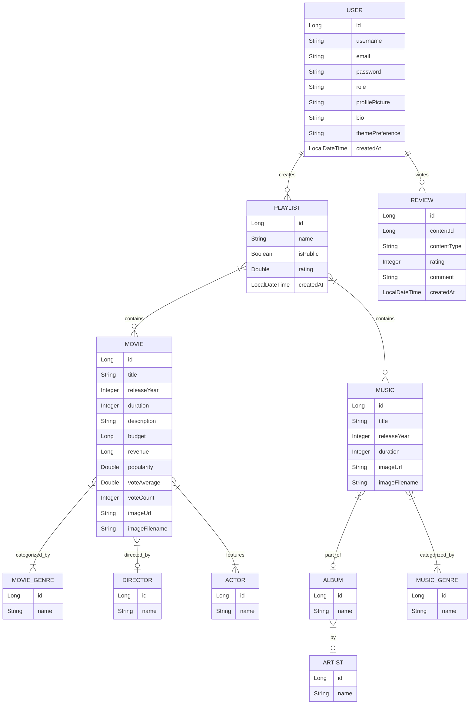

# Entity Relationship Diagram (ERD)

```mermaid
erDiagram
    USER ||--o{ PLAYLIST : creates
    USER ||--o{ REVIEW : writes
    
    PLAYLIST }|--o{ MOVIE : contains
    PLAYLIST }|--o{ MUSIC : contains
    
    MOVIE }|--|{ MOVIE_GENRE : categorized_by
    MOVIE }|--o| DIRECTOR : directed_by
    MOVIE }|--|{ ACTOR : features
    
    MUSIC }|--o| ALBUM : part_of
    MUSIC }|--|{ MUSIC_GENRE : categorized_by
    ALBUM }|--o| ARTIST : by
    
    USER {
        Long id
        String username
        String email
        String password
        String role
        String profilePicture
        String bio
        String themePreference
        LocalDateTime createdAt
    }
    
    PLAYLIST {
        Long id
        String name
        Boolean isPublic
        Double rating
        LocalDateTime createdAt
    }
    
    MOVIE {
        Long id
        String title
        Integer releaseYear
        Integer duration
        String description
        Long budget
        Long revenue
        Double popularity
        Double voteAverage
        Integer voteCount
        String imageUrl
        String imageFilename
    }
    
    MUSIC {
        Long id
        String title
        Integer releaseYear
        Integer duration
        String imageUrl
        String imageFilename
    }
    
    ALBUM {
        Long id
        String name
    }
    
    ARTIST {
        Long id
        String name
    }
    
    DIRECTOR {
        Long id
        String name
    }
    
    ACTOR {
        Long id
        String name
    }
    
    MOVIE_GENRE {
        Long id
        String name
    }
    
    MUSIC_GENRE {
        Long id
        String name
    }
    
    REVIEW {
        Long id
        Long contentId
        String contentType
        Integer rating
        String comment
        LocalDateTime createdAt
    }
```
