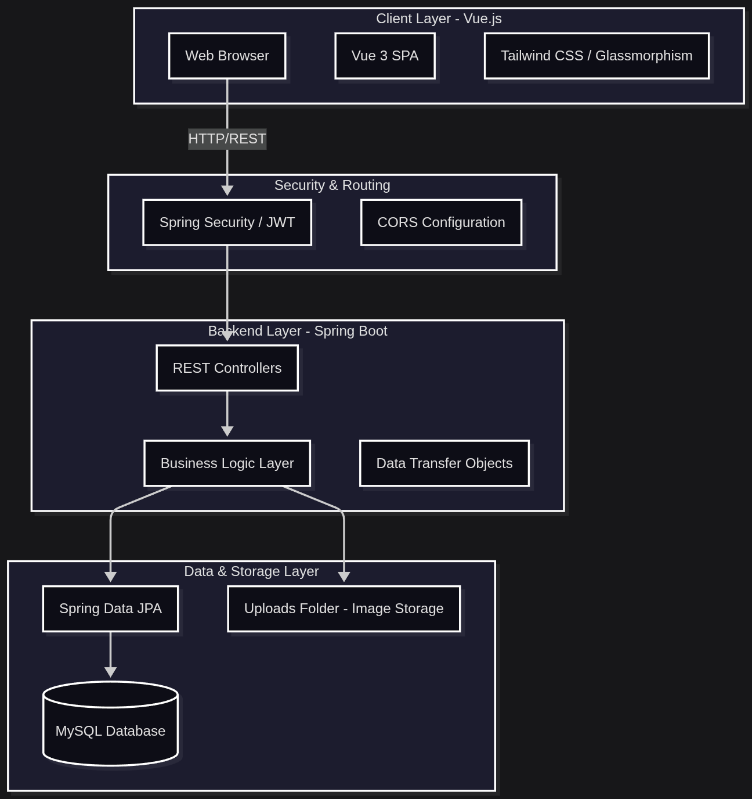
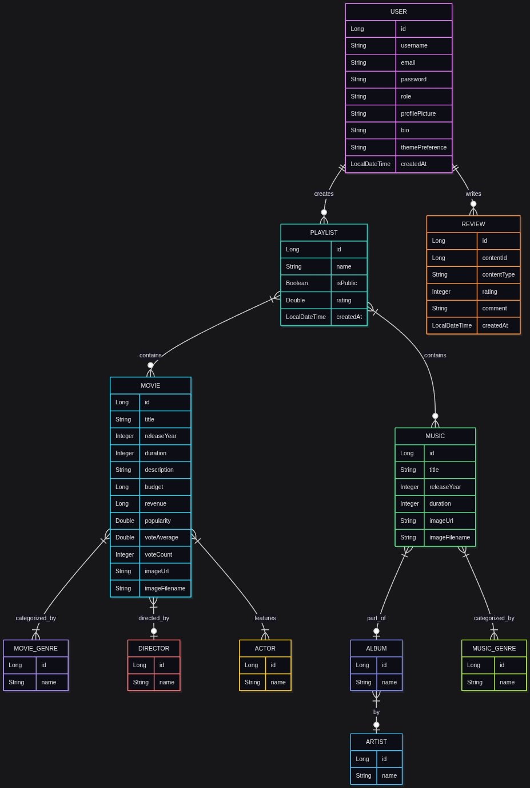
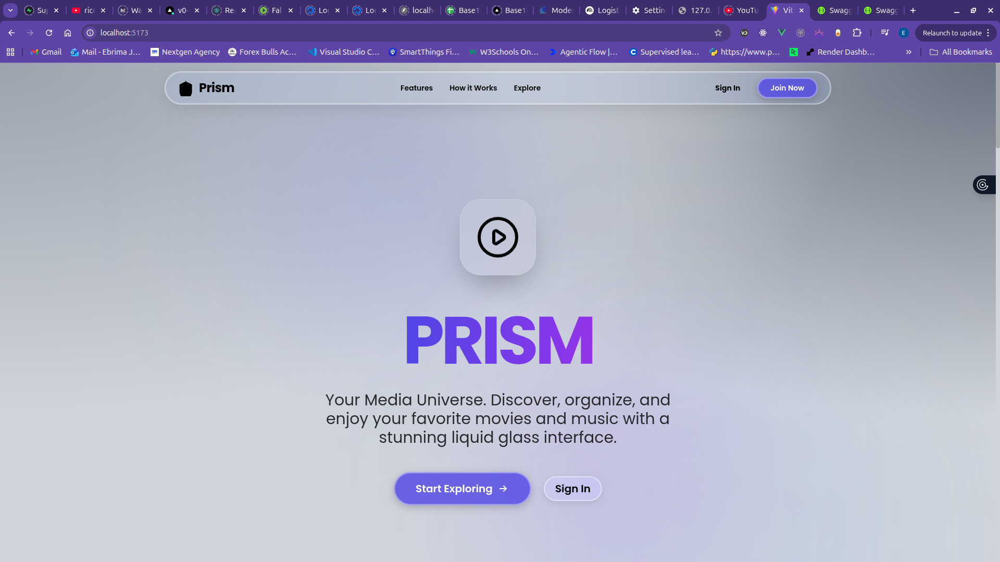
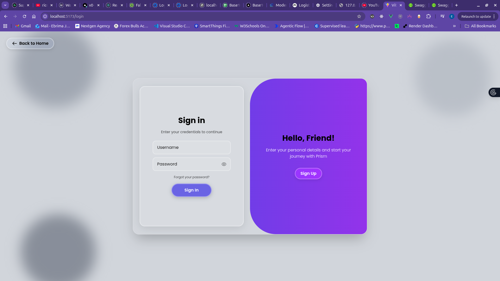
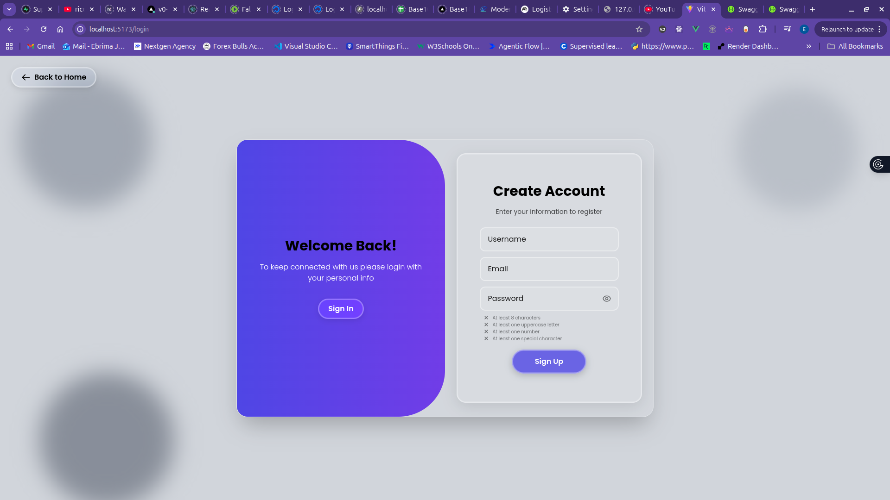
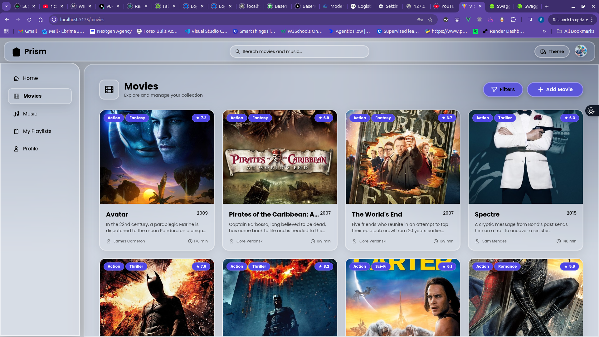
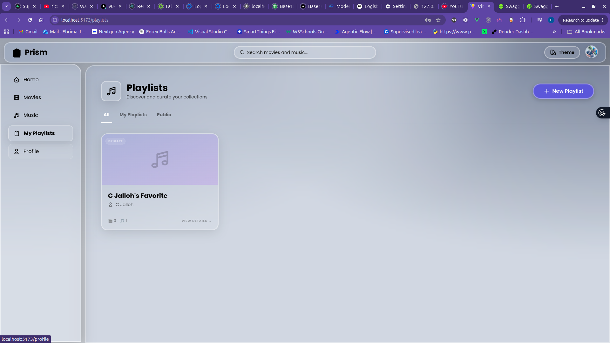
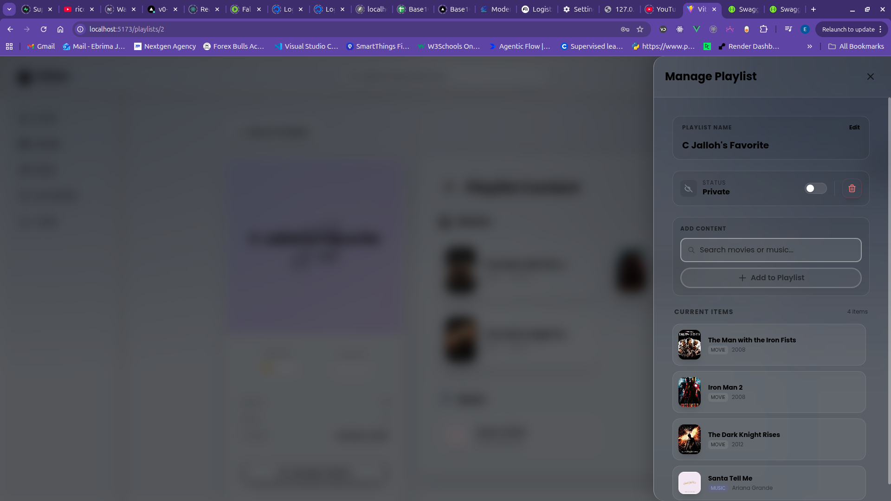

**Project Title:** Prism: A Liquid Glass Media Management System  
**Course Code:** Advanced Application Development  
**Date:** January 11, 2026  

---

## 1. Title Page

**Project Name:** Prism Media System  
**Student Names & IDs:**  
1. **Ebrima S Jallow** (Lead Developer) - MAT#: 22213296  
2. **Nyanya Janko** (Consultant) - MAT#: 22016021  
3. **Alieu Touray** (Backend Developer) - MAT#: 22226063  

**Institution:** The University of The Gambia  
**School:** School Of Information Technology and Communication
**Lecturer:** Mr. Jobe  

---

## 2. Introduction

**Prism** is a modern, high-fidelity media management application designed to provide users with a seamless interface for discovering and organizing movies and music. The system leverages a **Spring Boot** backend for secure data management and a **Vue 3** frontend featuring a sophisticated **"Liquid Glass" (Glassmorphism)** design aesthetic.

The primary objective of this project was to implement a full-stack real-world application that demonstrates proficiency in Java backend development, RESTful API design, database relational mapping, and secure user authentication.

---

## 2.1 Detailed Application Description

**Prism** is designed to solve the problem of fragmented media management. In an era of multiple streaming platforms, Prism offers a unified "Liquid Glass" interface where users can catalog their favorite movies and music tracks regardless of their origin.

### Design Philosophy: The "Prism" Aesthetic
The application utilizes a **Glassmorphism** (or "Liquid Glass") design language. This aesthetic is characterized by:
- **Translucency (Frosted Glass):** UI components use background blurs (`backdrop-filter`) to create a sense of depth and hierarchy.
- **Organic Gradients:** The application background features dynamic, soft-edged gradients that provide a vibrant yet non-intrusive atmosphere.
- **Fluid Layouts:** Using Tailwind CSS, the application is fully responsive, ensuring a consistent experience from desktop to mobile devices.

### User Experience (UX) Journey
1.  **Discovery:** Users land on a vibrant dashboard where they can filter movies by genre or year and browse music by artist or album.
2.  **Organization:** The core of Prism is its flexible Playlist system. Users can create themed collections (e.g., "Late Night Jazz" or "Action Weekend") and add both movies and music Tracks to them.
3.  **Interaction:** Users are not just passive viewers; they can rate media, write reviews, and customize their public profile to reflect their tastes.

---

## 2.2 System Architecture

The Prism Media System follows a modern **N-Tier Distributed Architecture**, ensuring a clean separation of concerns between the presentation, business logic, and data layers.

### Architectural Diagram

### Component Breakdown
1.  **Frontend (Presentation Layer):**
    - Built with **Vue 3** and **Vite** for rapid reactivity.
    - Uses **Tailwind CSS** for the custom Glassmorphism components.
    - **Pinia/Vue Store** manages global application states like User Authentication and Theme preferences.
    - **Axios** handles asynchronous communication with the backend.

2.  **Backend (Logic Layer):**
    - **Spring Boot 3.4.x** provides the core framework.
    - **Spring Security** implements the security firewall and JWT filter.
    - **Service Layer** handles complex business rules (e.g., validating playlist ownership).
    - **REST Controllers** expose the API endpoints for the frontend consumption.

3.  **Persistence Layer:**
    - **Spring Data JPA (Hibernate)** abstracts the database interactions.
    - **MySQL** serves as the persistent relational storage.
    - A local **File System Storage** strategy is used to serve media posters and profile pictures via a configured `WebMvcConfigurer`.

---

## 3. System Features & Requirements

### Core Features:
- **User Authentication:** Secure registration and login using JWT.
- **Media Discovery:** Browsing through curated lists of movies and music with advanced filtering.
- **Playlist Management:** Creating personal playlists, adding/removing media, and toggling public/private visibility.
- **Reviews & Ratings:** Users can leave reviews and star ratings on any media item.
- **Glassmorphism UI:** A premium "Liquid Glass" design system using translucency, backdrop blurs, and organic gradients.
- **Profile Customization:** Users can update their bio, profile picture, and theme preferences.

### Technical Requirements Met:
- **Backend:** Spring Boot 3.4.x, Java 17.
- **Security:** Spring Security with JWT.
- **Database:** MySQL with JPA/Hibernate.
- **API Documentation:** Integrated Swagger UI / OpenAPI 3.

---

## 4. Entity Relationship Diagram (ERD)

The database schema is designed with high normalization and clear relationships.

### Key Relationships:
- **User ↔ Playlists:** One-to-Many (A user can have multiple playlists).
- **Playlist ↔ Movies/Music:** Many-to-Many (Playlists contain many media items, and items can belong to many playlists).
- **Movie ↔ Genre/Actor:** Many-to-Many.
- **User ↔ Reviews:** One-to-Many.

---

## 5. API Endpoints Table

| Method | URL | Description |
| :--- | :--- | :--- |
| **POST** | `/api/auth/register` | Register a new user |
| **POST** | `/api/auth/login` | Login and receive JWT |
| **GET** | `/api/movies` | Fetch all movies with filters |
| **GET** | `/api/music` | Fetch all music tracks |
| **GET** | `/api/playlists` | Get current user's playlists |
| **POST** | `/api/playlists` | Create a new playlist |
| **PATCH** | `/api/playlists/{id}/toggle-public` | Toggle playlist visibility |
| **POST** | `/api/reviews` | Post a new review |
| **GET** | `/api/users/me` | Fetch current user profile |
| **PUT** | `/api/movies/{id}` | Update movie (Admin) |
| **DELETE** | `/api/playlists/{id}` | Delete a playlist |

---

## 6. Authentication Explanation (JWT Process)

Prism implements a stateless authentication flow:
1. **Login:** The user submits credentials to `/api/auth/login`.
2. **Token Generation:** The backend validates credentials and generates a **JSON Web Token (JWT)** signed with a 256-bit secret key.
3. **Storage:** The frontend receives the token and includes it in the `Authorization: Bearer <token>` header for all subsequent requests.
4. **Validation:** A custom `JwtFilter` on the backend intercepts every request, validates the signature, check expiration, and sets the Security Context for the user.

---

## 7. Business Logic Implementation

1. **Duplicate Prevention:** The system includes logic in the `PlaylistService` that checks for existing IDs before adding media to a playlist, ensuring no duplicates occur.
2. **Resource Ownership:** All "Write" operations on playlists or profiles check the authenticated user's ID against the resource owner's ID to prevent unauthorized modifications.
3. **Automated Metadata:** The system uses JPA `Lifecycle` events to automatically populate timestamps and default ratings (0.0) upon record creation.

---

## 8. System Screenshots

### Landing & Authentication

*Figure 1: The Prism Landing Page illustrating the Liquid Glass aesthetic.*

*Figure 2: Secure login interface.*

*Figure 3: Secure registration interface.*

### Media & Playlists

*Figure 4: Movie discovery grid with genre filtering.*

*Figure 5: Detailed view of a user created playlist.*

*Figure 6: The Glassmorphism management drawer for renaming and visibility toggles.*

---

## 9. Team Roles & Contributions

- **Ebrima S Jallow:** Lead Architect & Developer. Implemented the entire Vue 3 frontend, designed the Prism UI system, configured Spring Security/JWT, and handled end-to-end integration.
- **Alieu Touray:** Backend Developer. Implemented core CRUD features for Movies and Music, developed business logic for playlist management, and assisted with JPA mapping.
- **Nyanya Janko:** Project Consultant. Provided critical advisory on navigation flow, user feedback integration, and UI polish throughout the development cycle.

---
**GitHub Repository:** [https://github.com/C-Jalloh/Project.git](https://github.com/C-Jalloh/Project.git)
